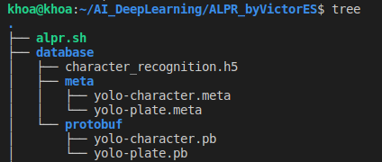
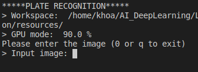
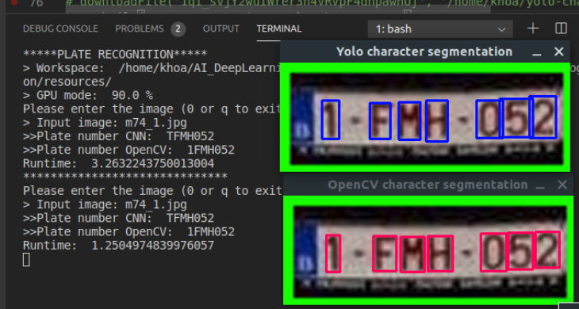

# Automatic License Plate Recognition by VictorES
Author: Nguyen Huynh Dang Khoa (aka Victor Nguyen)  
My partner: Eng. Nguyen Thi Minh Hien  

January-February 2020  
Major: Embedded System - Computer Science  
University: Danang University of Sciences and Technology  
## Special thank to TheophileBuy
- Firstly I want to thank you [TheophileBuy](https://github.com/TheophileBuy) so much that I use his prototype as the core part of my project. The idea is here [Idea](https://medium.com/@theophilebuyssens/license-plate-recognition-using-opencv-yolo-and-keras-f5bfe03afc65) 
- Basically we use OpenCV and YOLO to recognize the character on license plates, I try to modify to my our version and easier to use. If your want to train your own model, you should try his projects.  
# Thank you TheophileBuy.

## About
This is my project in Artificial Intelligence cource at my school. Basically, user input a photo of the license plate and it will ouput the number on it. This project is based on many resources and references. I hope you like it.
## How to install ?
- First make sure that you have python > 3.0, darkflow, tensorflow==1.14.0, numpy, imutils, and other dependency in python that we need in this project. See more in the documents/ directory.  
- Clone this directory by: git clone  
- After cloning this directory, you will need to download the database of this project, the database is the trained model that I trained for you first. You can actually modify the model if you want. Remember to place the database directory like this:

  
- I highly recommend you try my prototype database before going to train you own model at: [database](https://drive.google.com/drive/folders/1bmnd39-tHje1BAu_Dkwxe0WCu3RFsOC7?usp=sharing).  
- The yolo-plate.meta and yolo-plate.pb is for the plate detection. It is used to crop out the plate in the picture.
- Similarly the yolo-character.meta and yolo-character.pb is for character segmentations.  
- You can see the character_recognition.h5 is the model from CNN network to recognize the character after segmentation.  
- After doing this, you ready to Go.

## How to use ?
- Run ./alpr
- Wait for the system to initialize. 
- After it prompt to the Input image, you just type in the name of the image in the workspace.

- This is the expected result.

- You can actually change the workspace by ./alpr -f [workspace_path]  

## Troubleshoot
- More features about how to train your model by darkflow and get the database are in documents directory.
- Many references about AI, CNN, YOLO is in the documents also.
- If there is any trouble, please feel free to contact with me via email: khoanguyen1507vn@gmail.com.

## Hope you like this !!!
